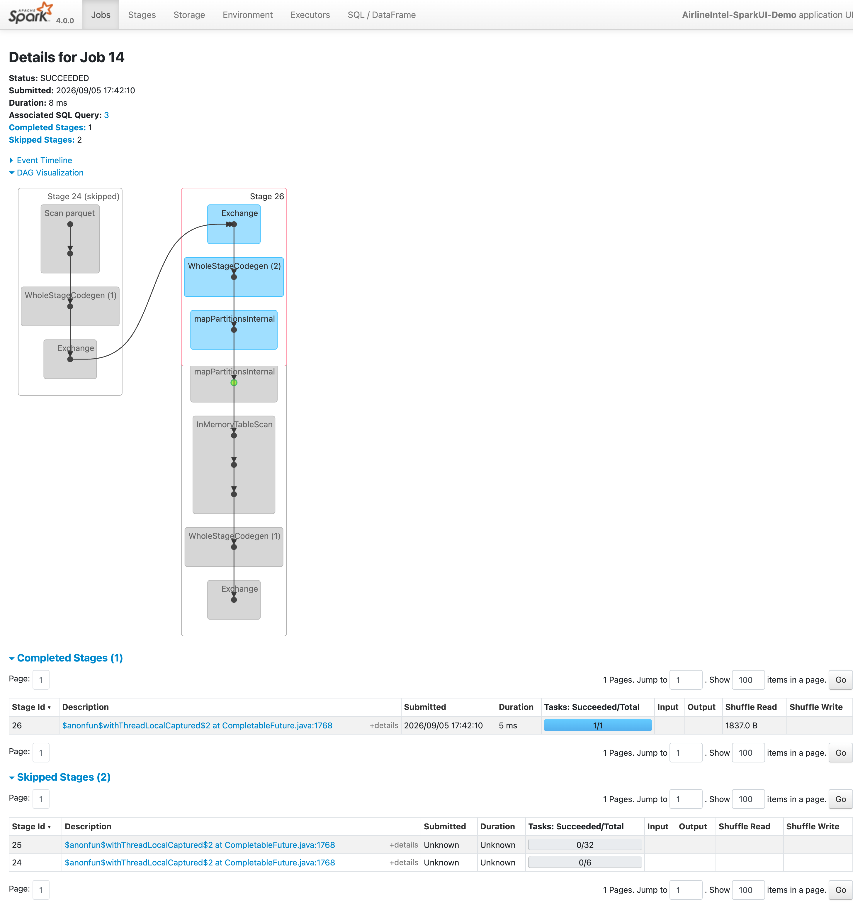

# Airline Operations Intelligence Platform — Project Report

**Course:** Big Data Analytics · **Type:** End-to-end big data analytics and decision-support platform

Every figure in this report was measured on the actual system. Nothing is estimated.

---

## 1. What was built

A complete pipeline from raw CSV to an interactive dashboard:

```
Dataset/flights.csv   565 MB   5,819,079 rows
   ↓  notebook 01 — load, audit, freeze schema
data/raw/*.parquet    137 MB   partitioned by month
   ↓  notebook 02 — 11 cleaning rules, row-count contract
data/curated/*.parquet 201 MB  5,819,078 rows × 49 columns
   ↓  notebook 11 — join NOAA ISD hourly weather (424 MB raw)
flights_weather.parquet        5,819,078 rows × 61 columns
   ↓  notebooks 05–07, 12 — aggregations, classification, clustering, rotation
data/marts/*.parquet           dashboard-ready documents
   ↓  notebook 08 — push + index (one collection per mart, auto-discovered)
MongoDB
   ↓
Streamlit dashboard   7 pages, all queries < 2 ms
```

**Environment:** Java 21.0.2, Python 3.12.1, PySpark 4.0.0, `local[6]`, 3 GB driver
(5 GB for the ML notebooks), on an 8 GB / 8-core machine. Everything runs locally; no cloud
services required.

---

## 2. Unit 1 — Big Data characteristics

### The 5 V's, with measured evidence

| V | Evidence from this project |
|---|---|
| **Volume** | 5,819,079 flight records × 31 raw columns, 565 MB CSV. Too large for spreadsheet tools; comfortable for Spark |
| **Variety** | Structured CSV (flights, airlines, airports), columnar Parquet, semi-structured BSON documents in MongoDB, JSON model artefacts |
| **Velocity** | Notebook 09 replays 16,989 flights through Spark Structured Streaming in 6 micro-batches, with state accumulating across batches |
| **Veracity** | The core finding of notebook 01: **486,165 flights (8.4%) carry DOT numeric airport codes instead of IATA**, and a naive inner join deletes them silently. Plus 105,071 structural nulls and 1 duplicate business key |
| **Value** | Delay causes quantified (late aircraft 39.8% of delay minutes), airports grouped into 4 operational profiles, delay risk predicted at ROC-AUC 0.7134 (0.6580 on a temporal split) |

### Veracity in detail — the defect that mattered most

For **October 2015 only**, `ORIGIN_AIRPORT` and `DESTINATION_AIRPORT` store 5-digit DOT
codes rather than 3-letter IATA codes. `airports.csv` is IATA-keyed, so an inner join
discards those 486,165 rows **without raising an error**. The pipeline would succeed and
every airport, route and monthly metric would be quietly wrong.

This is the characteristic big-data failure: not a crash, but confidently incorrect output
at a scale nobody can eyeball.

**Recovered without an external lookup table.** `DISTANCE` is deterministic per airport
pair, so the *set* of distances an airport flies is a fingerprint. Fingerprints alone tie
for small airports (23 DOT codes match ATL perfectly), so flight volume was added as a
second signal, scores resolved to a strict one-to-one assignment, and the result validated
against a signal it was not fitted on — each October route's distance must match that IATA
pair in the other 11 months.

**Result: 307/307 codes resolved, 99.910% distance agreement (±1 mile).**

### Challenges encountered

| Challenge | How it appeared | Resolution |
|---|---|---|
| Missing values | 81.72% null in delay-cause columns | Proved structural: populated for exactly the 1,063,439 flights arriving 15+ late |
| Inconsistent codes | October's DOT codes | Data-driven recovery, validated |
| Duplicates | 1 business-key collision in 5.8M rows | Deduplicated on a 7-column key |
| Join complexity | 3 sources, 2 join keys | LEFT joins with asserted zero unmatched |
| Class imbalance | 18.61% positive | Class weights; F1 and ROC-AUC reported, not accuracy |
| Memory limits | 8 GB, driver OOM during training | `MEMORY_AND_DISK` + staged unpersists |

---

## 3. Unit 2 — Frameworks and MapReduce

### Distributed computing

PySpark distributes ETL, aggregation and ML across 6 task slots. In `local[6]` the driver
and executors share one JVM; the same code runs unchanged on a cluster, with only the
master URL differing.

### HDFS concepts (documented, not deployed)

HDFS splits files into 128 MB blocks replicated 3× across DataNodes, with a NameNode
holding the metadata. This project uses the local filesystem, but two HDFS-ecosystem
properties are used directly:

- **Parquet** — the Hadoop columnar format, with embedded schema and per-column compression
- **Directory partitioning** — `month=7/` layout, the same scheme Hive and HDFS-based tools use

### MapReduce, demonstrated (notebook 03)

`map` → shuffle → `reduceByKey` implemented on real data, including the awkward case:
computing an average requires carrying `(sum, count)` pairs through the reduce and dividing
at the end, because averages are not associative.

### Limitations of MapReduce, measured

| Limitation | Evidence |
|---|---|
| Disk I/O between jobs | 5 iterative passes: **29.52s** recomputing vs **12.39s** cached (2.4×) |
| Verbosity | Average delay: 4 chained RDD operations with manual `(sum, count)` vs one `groupBy().agg()` |
| No optimisation | RDD 21.91s vs DataFrame 0.41s for an identical result (**53×**) |
| Rigid model | Only map-then-reduce, versus an arbitrary DAG |

### Batch vs real-time

| Aspect | Batch (01–08) | Streaming (09) |
|---|---|---|
| Schema | Inferred once | **Must** be declared — no data may exist at start |
| Trigger | Manual | Automatic on new files |
| State | None between runs | Checkpointed, survives restart |
| Latency | Minutes over 5.8M rows | Sub-second per micro-batch |

Notebook 09 asserts the streaming result is **identical to the batch result** over the same
16,989 rows — the same DataFrame code, two execution modes.

---

## 4. Unit 3 — NoSQL

Covered in full in [`nosql_comparison.md`](nosql_comparison.md): RDBMS vs NoSQL with an
honest assessment that a relational database would also work at this size, CAP applied to
MongoDB (CP, with the caveat that this single node has no partition to tolerate), the four
NoSQL families, document modelling for read patterns, and sharding/replication.

**Indexing, measured** (notebook 08): a route lookup goes from `COLLSCAN` examining all
4,706 documents to `IXSCAN` examining **1**.

---

## 5. Unit 4 — Apache Spark

### The three APIs, benchmarked on identical output (notebook 03)

| API | Time | vs RDD |
|---|---|---|
| RDD `map`/`reduceByKey` | 21.91s | 1.0× |
| DataFrame `groupBy().agg()` | 0.41s | **53×** |
| SparkSQL | 0.28s | **78×** |

DataFrame and SparkSQL compile to the *same* Catalyst plan — verified by comparing
optimised plans after normalising expression ids.

### Core concepts, each measured (notebook 10)

| Concept | Measurement |
|---|---|
| Lazy evaluation | 5 transformations 0.29s → `collect()` 1.22s |
| Narrow vs wide | 0.19s → 0.41s once a shuffle is introduced |
| Partitioning | 24 partitions 0.99s vs 200 partitions 1.93s |
| Caching a shuffled aggregate | 1.60s → 0.22s (**7.2×**) |
| Fault tolerance | Cache destroyed; result **recomputed from lineage** and asserted identical |
| Explicit schema | 8.2× faster load than `inferSchema` |
| Parquet vs CSV | 565 MB → 144 MB; 2.7× faster 3-of-31-column scan |

### The Spark UI — lazy evaluation and the DAG, as the engine reports them

Captured with `scripts/spark_ui_demo.py`, which runs a narrow pipeline, a shuffle, a
broadcast join, a cache and a SQL query against the real 5.8M-row dataset and holds the
session open. It is a separate script from notebook 10 on purpose: notebook 10 publishes
benchmark timings, and driving a browser alongside it is the same concurrent load that
invalidated the scaling measurement once already (**D5**).

| View | File | What it shows |
|---|---|---|
| Jobs | [`spark_ui_jobs.png`](images/spark_ui_jobs.png) | 18 jobs from 5 actions — each action triggers its own job, which is lazy evaluation made visible |
| Stages | [`spark_ui_stages.png`](images/spark_ui_stages.png) | Stage boundaries, task counts, shuffle read/write per stage |
| **DAG** | [`spark_ui_dag.png`](images/spark_ui_dag.png) | Job 14's graph |
| SQL / DataFrame | [`spark_ui_sql.png`](images/spark_ui_sql.png) | Catalyst's physical plans per query |
| Storage | [`spark_ui_storage.png`](images/spark_ui_storage.png) | The cached partitions and their memory/disk split |



Three things in that DAG are worth reading directly:

1. **The stage boundary is the `Exchange`.** Everything above it in Stage 24 is narrow and
   pipelined into one `WholeStageCodegen` block; the shuffle is what forces a new stage.
   This is the narrow-vs-wide distinction, drawn by the engine rather than asserted.
2. **Two stages are marked *skipped*.** Spark found their shuffle output already on disk
   from an earlier job and reused it instead of recomputing — the same lineage machinery
   that provides fault tolerance, used here as an optimisation.
3. **`InMemoryTableScan` appears in place of a file scan**, because that branch reads the
   cached DataFrame. This is exactly the substitution that hid partition pruning in
   notebook 04 until the cache was cleared before the Catalyst demonstration.

### Catalyst, read off the physical plan (notebook 04)

- `PartitionFilters: [(month = 7)]` — prunes 11 of 12 directories at file level
- `PushedFilters: [EqualTo(status,completed)]` — evaluated inside the Parquet reader
- `ReadSchema:` 3 of 49 columns — the other 46 never read

### Fault tolerance: lineage vs replication

Hadoop replicates data (3 copies). Spark records **how to recompute** each partition.
Notebook 10 destroys every cached partition and rebuilds the result, asserting equality
with the pre-loss answer — computational redundancy rather than storage redundancy.

---

## 6. Unit 5 — Analytics and machine learning

### Preprocessing

11 rules derived from evidence in notebook 01, implemented in notebook 02 with a
**row-count contract** asserted at every stage. Result: **100.000% retention**
(5,819,078 of 5,819,079; the single lost row is the duplicate key).

### Classification — delay prediction (notebook 06)

Target: arrival delay ≥ 15 minutes. Train 4,571,843 / test 1,142,165, positive rate 18.62%.

The notebook is structured as an **ablation study** rather than a model bake-off: one
change at a time, every step evaluated on the same held-out split, so each gain has a named
cause. Steps that gained nothing stay in the table.

| Step | ROC-AUC | F1 | Δ AUC | Train time |
|---|---|---|---|---|
| 0. Logistic Regression | 0.6503 | 0.3678 | — | 25s |
| 1. Random Forest | 0.6626 | 0.3765 | +0.0123 | 205s |
| 2. + tuned threshold | 0.6626 | 0.3765 | **+0.0000** | 171s |
| 3. + weather features | 0.6771 | 0.3849 | +0.0145 | 163s |
| 4. + interaction features | 0.6811 | 0.3874 | +0.0040 | 147s |
| 5. Gradient-Boosted Trees | 0.6976 | 0.4008 | +0.0165 | 386s |
| **6. GBT, tuned** | **0.7134** | **0.4165** | +0.0158 | 1041s |
| 7. *Temporal split* | *0.6580* | *0.3389* | *honesty check* | 1181s |

**Net movement: ROC-AUC 0.6503 → 0.7134, F1 0.3678 → 0.4165.** Step 6 is the deployed
model — `maxDepth` 8, `maxIter` 80, decision threshold 0.55, found by `TrainValidationSplit`
over four configurations.

**Step 2 is a null result and is reported as one.** Threshold tuning gained *exactly* zero
on the weighted Random Forest, because class weighting had already placed the F1 optimum at
0.50. Deleting the row would have made the study look cleaner and been dishonest; the step
earns its keep at step 5, where GBT's optimum is 0.55.

**Accuracy below the 81.39% baseline is the intended trade.** A model predicting "on time"
every time scores 81.39% and is useless. The tuned GBT reaches 71.56% accuracy while
catching **115,922 of 212,152 delayed flights (54.6%)** at 33.65% precision.

Two methodological safeguards:

1. **Leakage enforced in code.** A `BANNED` set of 18 columns (`dep_delay`, taxi times,
   `air_time`, actual times, the five cause columns, `status`) is asserted against the
   feature set before *every* fit — not documented in a comment, executed as an assertion.
2. **Historical rate features computed from the training split only**, with Bayesian
   smoothing toward the global mean. Computing them over the full dataset would leak
   test-set outcomes into training features — a subtle and common error.

Top features, with names resolved from the vector's `ml_attr` metadata rather than a
hand-maintained list:

| Feature | Importance |
|---|---|
| `origin_hour_delay_rate` | 0.1063 |
| `month` | 0.0894 |
| `origin_delay_rate` | 0.0756 |
| `dewpoint_c` | 0.0731 |
| `temp_c` | 0.0677 |

Weather columns together account for **28.5%** of total importance.

**The random split flatters the model.** Step 7 retrains on Jan–Sep and tests Oct–Dec:
ROC-AUC falls to **0.6580**. Part of that is genuine distribution shift — the delay rate
itself moves from 19.45% to 16.07% across the boundary. The 0.7134 headline should always
be read next to it.

### External data — NOAA weather enrichment (notebook 11)

The proposal calls for a second data source and for unstructured data. NOAA's Integrated
Surface Database supplies both.

| Measurement | Result |
|---|---|
| Airports matched to ISD stations | 60 (57 by ICAO `K`+IATA, 3 by nearest-neighbour) |
| Flights covered | 4,924,097 — **84.6%** of the dataset |
| Raw ISD ingested | 424 MB hourly observations |

The three ICAO failures are **HNL, SJU and OGG**: Hawaii and Puerto Rico use the `PH` and
`TJ` prefixes, so `K`+IATA cannot resolve them by construction. A haversine nearest-station
fallback places all three within 1.2 km.

Two hazards that would have silently corrupted the features:

- **ISD sentinel values.** Missing temperature is `+9999`, not null. Scaled by the
  documented divisor of 10 it becomes a plausible 999.9 °C and poisons every mean
  downstream. Each composite field is split component-wise and its sentinel mapped to
  `NULL` before scaling.
- **Schema drift across stations.** ISD files carry 82–104 columns depending on which
  instruments a station reports. A single directory-glob read fails; the notebook reads
  per-file and unions by name.

**Unstructured text.** `metar_text` is free-form aviation weather —
`METAR KMIA 010053Z 33005KT 10SM BKN049 24/19 A3018 RMK AO2 SLP219`. Six phenomena are
extracted by regex into boolean features: thunderstorm, snow, rain, fog, freezing
precipitation and haze/smoke. Negative lookbehinds keep `FZRA` from being counted as rain
and catch intensity-prefixed forms such as `-SN`.

Weather contributed **+0.0145 ROC-AUC** (step 3) — real, but smaller than its crosstabs
suggest. Freezing precipitation carries a 54.65% delay rate against a 19.05% base, yet
occurs on 0.18% of flights; a large effect on a thin slice moves aggregate AUC very little.
That gap between a striking conditional rate and a modest aggregate gain is itself the
lesson.

### Delay propagation — the aircraft rotation model (notebook 12)

Notebook 05 measured late aircraft as the largest single cause of delay minutes (39.84%).
Notebook 06 cannot see it: it scores each flight independently, with no notion that the
aircraft was somewhere else two hours ago. Notebook 12 reconstructs the daily chain with a
window over `(tail_number, flight_date)` and measures what that blindness costs.

**75.2%** of flights have a traceable inbound leg. For those, the relationship is strong:

| Inbound arrived | Flights | Delay rate | vs 18.61% base |
|---|---|---|---|
| early / on time | 2,735,959 | 9.65% | −8.97 pp |
| 0–15 min late | 879,192 | 17.33% | −1.28 pp |
| 15–30 min late | 294,830 | 41.89% | +23.28 pp |
| 30–60 min late | 218,516 | 74.60% | +55.99 pp |
| 60–120 min late | 131,599 | **87.26%** | +68.65 pp |
| 2+ hours late | 67,649 | 80.59% | +61.98 pp |

Pearson correlation, inbound arrival delay vs this flight's: **0.5078**. Delay compounds
along the chain — leg 2 of an aircraft's day runs 16.15% late, leg 7 runs 28.03%, with mean
arrival delay rising 2.08 → 11.98 minutes.

Two models were then trained on the same split with the same tuned hyperparameters. The
only difference is four rotation features.

| Model | ROC-AUC | F1 | Precision | Recall | Accuracy |
|---|---|---|---|---|---|
| Planning (no rotation) | 0.7138 | 0.4165 | 0.3371 | 0.5450 | 0.7162 |
| **Day-of (with rotation)** | **0.8320** | **0.5967** | **0.6745** | 0.5350 | **0.8656** |

**Precision doubled at unchanged recall** — the same delays caught with half the false
alarms. The day-of model also reaches 86.56% accuracy, clearing the 81.39% majority-class
baseline that §6's planning model never does. `prev_arr_delay` carries 37.3% of importance
on its own; the four rotation features carry **53.2%** between them.

**These are answers to different questions and are never merged.** `prev_arr_delay` is the
inbound's *actual* arrival delay — available hours before departure, not weeks. Quoting
0.8320 as an improvement on notebook 06's 0.7134 would be changing the question to make the
answer look better. The planning number remains the project's headline.

The planning model's 0.7138 also independently reproduces notebook 06's 0.7134 through a
separate code path, which is a useful check on both.

**A prediction that was wrong.** §5 of the notebook originally argued the gain would be
"real but bounded" because schedules build in turnaround slack. It was written before the
run and the data refuted it. Slack does absorb delay — an inbound 0–15 minutes late leaves
the next flight *below* the network rate — but it collapses in the tail, and the tail is
what matters. The notebook keeps the wrong prediction alongside the correction.

### Clustering — airport profiles (notebook 07)

K-Means over 6 operational features, on the 80 airports meeting the 10,000-flight
threshold. k = 4 (silhouette 0.351; WCSS 226.8).

| Profile | Airports | Avg flights | Delay rate | Examples |
|---|---|---|---|---|
| High-traffic hub, elevated delays | 16 | 170,858 | 20.6% | ATL, ORD, DFW, DEN, LAX |
| High-traffic hub, well-managed | 33 | 47,141 | 17.1% | MSP, SEA, DTW, CLT |
| Smaller airport, elevated delays | 21 | 26,998 | 18.0% | MDW, MIA, DAL, HOU |
| Smaller airport, reliable | 10 | 33,525 | 12.5% | SLC, PDX, HNL, SNA |

`StandardScaler` is essential: `total_flights` spans 50–300,000 while rates are 0–100, so
unscaled K-Means would simply sort airports by size.

Silhouette alone prefers k=2 (0.446), but two clusters cannot distinguish airport types
usefully. Both criteria are reported so the choice is auditable rather than asserted.

### Analytical findings

Overall: **81.39% on-time**, 18.61% delayed, 1.54% cancelled, 0.26% diverted.

| Delay cause | Share of delay minutes | Avg min per late flight |
|---|---|---|
| Late aircraft | 39.84% | 23.47 |
| Carrier | 32.20% | 18.97 |
| NAS | 22.88% | 13.48 |
| Weather | 4.95% | 2.92 |
| Security | 0.13% | 0.08 |

Best airline: Hawaiian (11.33% delay rate). Worst: Spirit (29.71%). Delay risk compounds
through the operating day and resets overnight — consistent with late aircraft being the
dominant cause.

---

## 7. Unit 6 — Applications, ethics, privacy and bias

### Application domain
Aviation and transportation analytics — a documented real-world big-data domain, generating
continuous high-volume operational data.

### Privacy and security
- **No passenger PII.** The dataset contains operational records only: no names, bookings
  or personal data. `TAIL_NUMBER` identifies aircraft, not people.
- **Credentials never hardcoded.** MongoDB URI in `.env`, git-ignored, with `.env.example`
  committed. Verified: `.gitignore` excludes `.env`, `Dataset/*.csv`, `data/`.
- **Local deployment** — no data leaves the machine.

### Ethical concerns
- **Fair airline comparison.** Sample sizes accompany every rate throughout the dashboard.
- **Historical limitation.** 2015 data does not describe airlines today. The platform is an
  academic analytics tool and states so; it is not for booking decisions.
- **Self-reported delay causes.** Carriers report their own carrier/weather/NAS attribution,
  so a systematic incentive to under-report carrier fault cannot be ruled out. Documented.
- **Licensing.** US DOT/BTS data is public domain; OurAirports is open data.

### Bias, identified and mitigated

| Bias | Evidence | Mitigation |
|---|---|---|
| **Small-sample** | Unfiltered, the "worst" airport is GST at 44.74% on **76 flights**; with a 10,000-flight threshold it is LGA at 23.39% on **103,281** | `HAVING`/`meets_min_sample` thresholds before every ranking; sample sizes always shown |
| **Class imbalance** | 81.4% accuracy achievable by always predicting "on time" | Class weights; F1, recall, ROC-AUC and confusion matrix reported alongside accuracy |
| **Clustering small airports** | 200-flight airports would receive confident but noise-driven labels | Only the 80 eligible airports are clustered; the rest keep all metrics with `cluster_id = null` |
| **Geographic** | US domestic only | Stated; results do not generalise internationally |
| **Temporal** | Single year | Stated; seasonal patterns may not hold across years |
| **Coverage** | 3 airports lack coordinates | Retained in all metrics, excluded from the map only |

---

## 8. Evaluation

### Data engineering
Pipeline runs raw CSV → curated Parquet → MongoDB, reproducibly. Row-count contract
asserted at every ETL stage; **100.000% retention**. KPIs cross-checked against independent
direct queries (all match to 0.01); airline, airport and route totals each reconcile to
5,819,078.

### Performance

| Optimisation | Before | After | Gain |
|---|---|---|---|
| Explicit schema vs inference | 3.9s | 0.5s | 8.2× |
| CSV → Parquet (storage) | 565 MB | 144 MB | 3.9× |
| Partial-column scan | 0.6s | 0.2s | 2.7× |
| Caching a shuffled aggregate | 1.60s | 0.22s | 7.2× |
| DataFrame vs RDD | 21.91s | 0.41s | 53× |
| MongoDB index | 4,706 docs scanned | 1 | 4,706× |

### Dashboard
Seven pages, all verified headlessly with `streamlit.testing.AppTest` — zero exceptions.
The prediction path was exercised end to end. With MongoDB stopped, all pages still render
from the Parquet fallback, and the home page states which source is live.

`AppTest` is necessary but not sufficient: the airport map once rendered every US airport
over Africa and passed the whole suite, because a missing `center`/`zoom` is not an
exception. Visual checks are part of the dashboard's verification for that reason.

---

## 9. Limitations and honest caveats

1. **The headline model number comes from a random split.** Both splits are now
   reported: stratified random gives ROC-AUC 0.7134, temporal (train Jan–Sep, test
   Oct–Dec) gives 0.6580. The temporal figure is the honest forecasting claim, and the
   gap is partly genuine distribution shift — the delay rate moves 19.45% → 16.07% across
   that boundary.
2. **Local mode cannot measure distributed cost.** `reduceByKey` vs `groupByKey` showed
   only ~1.2× here, because a single machine has no network for a combiner to save. The
   syllabus principle stands; this environment cannot demonstrate it.
3. **A file source is not Kafka.** The streaming programming model is identical, but
   partitioned consumption, offset replay and back-pressure are not exercised.
4. **Single-node MongoDB.** No replica set, so the CAP analysis describes how it would
   behave in production, not what is running.
5. **7 airports (617 flights, 0.011%) validate below 95%** in the DOT-code recovery —
   tiny and seasonal airports. Documented rather than hidden.
6. **The rotation model is not a better version of the planning model.** Notebook 12
   reaches ROC-AUC 0.8320, but only by using the inbound aircraft's actual arrival delay,
   which is unknowable at planning time. The two are reported separately throughout, and
   0.7134 remains the headline. Only 75.2% of flights have a traceable inbound at all.
7. **Weather covers 84.6% of flights, not all of them.** 60 airports were matched to NOAA
   stations; flights through smaller airports carry imputed values, with the imputation
   done from training-split means only.
8. **A published benchmark was wrong and has been retracted.** The scaling section of
   notebook 10 originally reported a memory wall at full data size. It was CPU contention
   from a concurrent training job, not a memory limit — re-measured on an idle machine the
   curve is sub-linear (1.05M → 1.64M rows/s). The retraction is written up as **D5** in
   `engineering_decisions.md`. A benchmark taken on a busy machine measures the machine,
   not the code.
9. **HDFS is documented, not deployed.** Setting up a real cluster was out of scope for
   the environment; §3 describes the architecture and the concepts it would demonstrate.

---

## 10. Deliverables

| Deliverable | Location |
|---|---|
| 12 notebooks, all executed | `notebooks/` |
| Curated Parquet + marts | `data/` (git-ignored, regenerable) |
| MongoDB serving layer | `docker compose up -d`, notebook 08 |
| Streamlit dashboard, 7 pages | `app/` |
| Project report | this file |
| Data dictionary | `docs/data_dictionary.md` |
| NoSQL analysis | `docs/nosql_comparison.md` |
| Engineering decisions, defects and one retraction | `docs/engineering_decisions.md` |
| All measured figures in one place | `docs/testing_and_performance.md` |
| Environment smoke test | `scripts/smoke_test.py` |
| Weather ingestion, streaming producer/consumer | `scripts/` |

### Reproducing from scratch

```bash
uv venv --python 3.12 .venv
uv pip install --python .venv/bin/python "pyspark[sql]==4.0.0" pandas pyarrow numpy \
    ipykernel pymongo python-dotenv streamlit plotly requests
.venv/bin/python scripts/smoke_test.py        # expect PASS
# notebooks 01 → 05 build the curated data and marts
.venv/bin/python scripts/fetch_weather.py     # NOAA ISD, ~424 MB (needed by 11, 06, 12)
# then notebooks 11, 06, 07, 12, 08, 09, 10
docker compose up -d
.venv/bin/streamlit run app/Home.py
```
